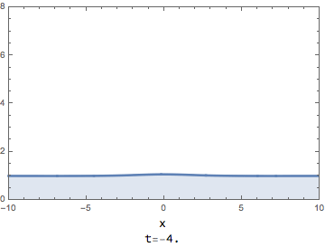
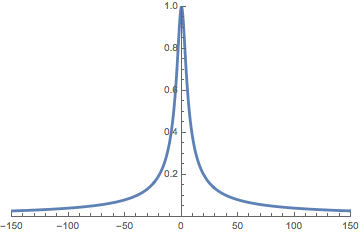

## Spectral Singularities
Consider for example the Riemann-Hilbert problem satisfied by the Beals-Coifman eigenfunction matrix $\mathbf{M}(z;x,t)$ for the focusing nonlinear Schrödinger (NLS) equation with an oriented jump contour $\Sigma$ that is the continuous spectrum of the underlying non-self-adjoint Zakharov-Shabat operator.

*Spectral singularities* in context of the Riemann-Hilbert problem satisfied by $\mathbf{M}(z;x,t)$ are values $s\in\Sigma$ for which $\mathbf{M}(z;x,t)$ fails to admit a continuous boundary value as $z \to s\in\Sigma$ non-tangentially from at least one side of $\Sigma$. Poles of $\mathbf{M}(z;x,t)$ in the complement of $\Sigma$ are associated with the discrete spectrum of the non-self-adjoint Zakharov-Shabat operator. As illustrated in [an example constructed by Zhou](https://onlinelibrary.wiley.com/doi/abs/10.1002/cpa.3160420702), it is known that even for Schwartz-class potentials $\psi$, $\mathbf{M}(z;x,t)$ may have infinitely many poles accumulating to points on $\Sigma$ from its complement and these accumulation points can themselves accumulate from within to severe spectral singularities.

There are also physical solutions that are associated with spectral singularities.

### Important examples of solutions associated with spectral singularities

+ **Rogue wave solutions of the nonlinear Schrödinger equation (NLS)**, which are $L^1$-perturbations of a nonzero background field. Rogue waves (also referred to as "freak waves" -- or even as "mad-dog waves") are surface waves that appear from nowhere, disappear without a trace and can cause great damage to ships of other fixed structures (e.g. oil platforms). Therefore it is of practical importance to study dynamical stability properties of rogue waves, in other words, to determine conditions on initial data sufficient to generate one or more of these **rogue wave** solutions. A model proposed for rogue waves is the Peregrine breather
$$
\psi_\mathrm{P}(x,t) :=e^{\mathrm{i}t}\left(1-\frac{4(1+2\mathrm{i}t)}{1+4[(x-x_0)^2+(t-t_0)^2]}\right),
$$
$(x_0,t_0)\in\mathbb{R}^2$, which is an exact solution of the focusing nonlinear Schrödinger equation
$$
\mathrm{i}\psi_t + \tfrac{1}{2}\psi\_{xx} + |\psi|^2\psi =0.
$$

+ **Algebraic solitons of the derivative nonlinear Schrödinger equation (DNLS)**
$$
\mathrm{i}\psi_t + \psi\_{xx} + \mathrm{i}(|\psi|^2\psi)_x =0,
$$
which have slow (algebraic) decay rate to the zero background field.

## A Robust Inverse Scattering Transform

To be able treat the Cauchy problem in context of inverse scattering transform (IST) techniques while allowing such solutions, one needs an IST that can handle, preferably arbitrary, spectral singularities.
In [A Robust IST for the Focusing NLS Equation]() we introduced a **robust IST** that deals with arbitrary-order poles and potentially severe spectral singularities in a simple and unified way. As an application, we used the robust IST to place the Peregrine solution and related higher-order **rogue wave** solutions in an inverse-scattering context for the first time. This allows one to directly study properties of these solutions such as their dynamical or structural stability, or their asymptotic behavior in the limit of high order singularity.

Availability of an IST that can treat rogue waves opens the door to study questions such as:

+ Are rogue wave solutions stable to localized perturbations? If not, what kinds of perturbations excite instabilities, and what is the long-term nonlinear saturation of the instabilities?

+ Is it possible to make a prediction based on the computation of some relevant scattering data as to how many Peregrine-like peaks will be generated from a localized perturbation of the background? In other words, what kind of initial conditions generate rogue waves?

+ How do rogue waves interact with other coherent structures, such as the time-periodic Kuznetsov-Ma soliton and its Galilean-boosted generalization sometimes called the Tajiri-Watanabe soliton? How do they interact with more general waves that are not in the realm of “exact solutions”?

+ Since it is possible to define mathematically a “rogue wave of order $N$” for arbitrary $N$,
what can be said quantitatively about the asymptotics for large $N$?

The robust IST applies to other integrable models of wave propagation by natural generalizations.

This project involves collaboration with [Peter D. Miller](http://www.math.lsa.umich.edu/~millerpd/).
